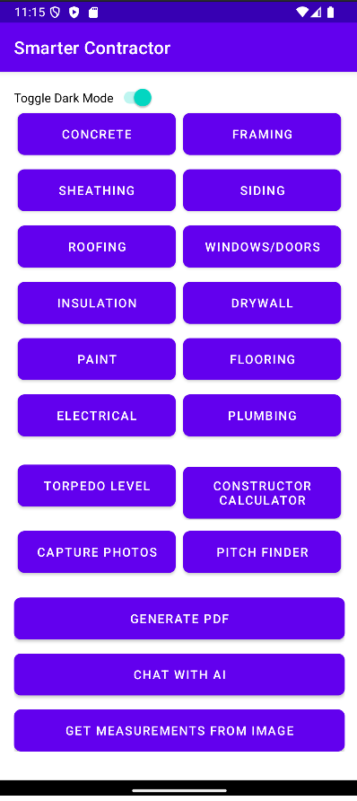

# Smart Contractor - Building Material Estimation App

Smart Contractor is an Android application designed to help construction professionals and DIY enthusiasts estimate building material requirements and costs with ease. The app provides tools for calculating quantities for different materials like concrete, framing, and other construction essentials, with additional features like camera integration, PDF generation, and digital leveling.

<dl>
  
  <dt>Features</dt>
  <dd>
    - **Material Calculators**: Predefined calculators for construction materials, such as:
      - **Concrete**: Calculates volume based on length, width, and depth.
      - **Framing**: Calculates material requirements for framing based on length and width.
    - **Camera Functionality**: Capture and save photos for documentation or reference in a dedicated "Smart Contractor" album.
    - **PDF Generation**: Creates PDF documents containing selected images, useful for project estimates or records.
    - **Pitch Finder**: Measures the slope or pitch using device sensors.
    - **Digital Level**: Uses the accelerometer to provide a visual indication of horizontal leveling.
    - **Dark Mode Support**: Toggle between light and dark themes.
  </dd>

  <dt>Technologies Used</dt>
  <dd>
    - **Java**: Core language for Android app development.
    - **Android SDK**: Framework and libraries used for building Android applications.
    - **SharedPreferences**: Stores user settings and app preferences.
    - **Camera API**: Captures images and saves them to a dedicated album.
    - **PDFDocument API**: Generates PDF files containing selected images.
    - **Sensors (Accelerometer)**: Measures device tilt for pitch calculation and leveling functionality.
    - **AppCompatDelegate**: Provides light and dark mode support based on user preference.
  </dd>

  <dt>Installation</dt>
  <dd>
    1. Clone this repository:
       ```bash
       git clone https://github.com/PatrickJamesRepo/SmartContractor.git
       ```
    2. Open the project in **Android Studio**.
    3. Sync Gradle and ensure all dependencies are installed.
    4. Connect an Android device or start an emulator.
    5. Run the app from Android Studio.
  </dd>

  <dt>Usage</dt>
  <dd>
    1. **Launch the App**: Open Smart Contractor on your Android device.
    2. **Select Calculator**: Choose a material calculator (e.g., Concrete, Framing).
    3. **Enter Dimensions**: Input required measurements (length, width, depth, etc.) and hit "Calculate" to get an estimate.
    4. **Camera & Image Capture**: Take photos and save them to the "Smart Contractor" album for later reference.
    5. **Generate PDF**: Select saved images to generate a PDF document, which can be used for project documentation.
    6. **Pitch Finder and Digital Level**: Use device sensors to measure pitch and determine horizontal level.
  </dd>

  <dt>Screenshots</dt>
  <dd>
    
    
    
  </dd>

  <dt>Contributing</dt>
  <dd>
    Contributions are welcome! Please follow these steps:

    1. Fork the repository.
    2. Create a new branch for your feature.
    3. Commit your changes and push them to the branch.
    4. Submit a pull request with a detailed description of your changes.
  </dd>

  <dt>License</dt>
  <dd>
    This project is licensed under the MIT License. See the [LICENSE](LICENSE) file for details.
  </dd>
</dl>
